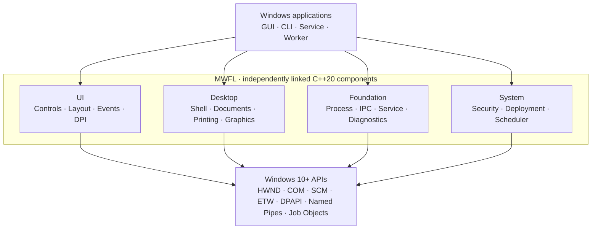

<p align="center">
  <a href="https://mwfl.github.io/">
    
  </a>
</p>

<h1 align="center">MWFL</h1>

<p align="center"><strong>Modern Windows Foundation Layer</strong></p>

<p align="center">
  Modern C++20 for native Windows 10+ applications—real HWNDs, less ceremony.
</p>

<p align="center">
  <a href="https://mwfl.github.io/"></a>
  <a href="https://github.com/mwfl/mwfl/releases/latest"></a>
  <a href="https://github.com/mwfl/mwfl/blob/main/LICENSE"></a>
</p>

If you are building a **Windows-only application**, target **Windows 10 or
newer**, and want current C++ without giving up native Windows behavior, MWFL
is designed for you.

- **Native:** real controls, messages, handles, accessibility, and direct Win32 interop.
- **Modern:** typed events, RAII, C++20 ranges, DPI-aware layout, and explicit ownership.
- **Complete:** UI plus Process, IPC, Service, Diagnostics, Security, Deployment, and Scheduler components.
- **Agent-friendly:** focused headers, explicit CMake targets, small examples, self-tests, and no generated UI files or hidden framework lifecycle.



## Native UI in ordinary C++

```cpp
#include <mwfl/mwfl.h>

using mwfl::operator""_dip;

class MainWindow final : public mwfl::WindowBase {
public:
    void BuildUI() override {
        SetTitle(L"Hello, MWFL");

        mwfl::ControlHost ui{*this};
        ui.Add(message_, L"A real HWND, composed with C++20.");
        ui.Add(close_, L"Close");

        SetLayout(mwfl::Column().Margin(24_dip).Gap(12_dip)
            .Add(message_, mwfl::Auto())
            .Add(close_, mwfl::Fixed(36_dip)));
    }

    mwfl::EventResult OnCommand(const mwfl::CommandEvent& event) override {
        if (event.IsClicked(close_)) {
            Close();
            return mwfl::EventResult::Handled();
        }
        return mwfl::EventResult::Propagate();
    }

private:
    mwfl::Label message_;
    mwfl::Button close_;
};
```

<p align="center">
  
</p>

## Lightweight tools built with MWFL

These local-first applications are useful tools and real-world validation for
the library. Each public Release provides a Windows x64 Portable ZIP—download,
extract, and run.

| Application | Purpose | Portable |
|---|---|---|
| [Folder Compare](https://github.com/mwfl/folder-compare) | Compare files and folders locally | [Download](https://github.com/mwfl/folder-compare/releases/download/v0.1.0/folder-compare-v0.1.0-windows-x64-portable.zip) |
| [Folder Explorer](https://github.com/mwfl/folder-explorer) | Inventory folders and inspect PE files | [Download](https://github.com/mwfl/folder-explorer/releases/download/v0.1.1/folder-explorer-v0.1.1-windows-x64-portable.zip) |
| [Hex Editor](https://github.com/mwfl/hex-editor) | Inspect and safely edit binary files | [Download](https://github.com/mwfl/hex-editor/releases/download/v0.1.2/hex-editor-v0.1.2-windows-x64-portable.zip) |
| [Markdown Editor](https://github.com/mwfl/markdown-editor) | Edit Markdown with offline preview | [Download](https://github.com/mwfl/markdown-editor/releases/download/v0.1.0/markdown-editor-v0.1.0-windows-x64-portable.zip) |
| [Notepad Colon](https://github.com/mwfl/notepad-colon) | Edit text and source code | [Download](https://github.com/mwfl/notepad-colon/releases/download/v0.1.0/notepad-colon-v0.1.0-windows-x64-portable.zip) |
| [PDF Reader](https://github.com/mwfl/pdf-reader) | Read local PDF documents in tabs | [Download](https://github.com/mwfl/pdf-reader/releases/download/v0.1.0/pdf-reader-v0.1.0-windows-x64-portable.zip) |
| [SQLite Viewer](https://github.com/mwfl/sqlite-viewer) | Browse SQLite databases read-only | [Download](https://github.com/mwfl/sqlite-viewer/releases/download/v0.1.0/sqlite-viewer-v0.1.0-windows-x64-portable.zip) |
| [Startup Manager](https://github.com/mwfl/startup-manager) | Safely manage Windows startup entries | [Download](https://github.com/mwfl/startup-manager/releases/download/v0.1.1/startup-manager-v0.1.1-windows-x64-portable.zip) |

Start with the [MWFL repository](https://github.com/mwfl/mwfl), the
[documentation](https://mwfl.github.io/), or the
[62 compiled examples](https://github.com/mwfl/mwfl/tree/main/examples).
